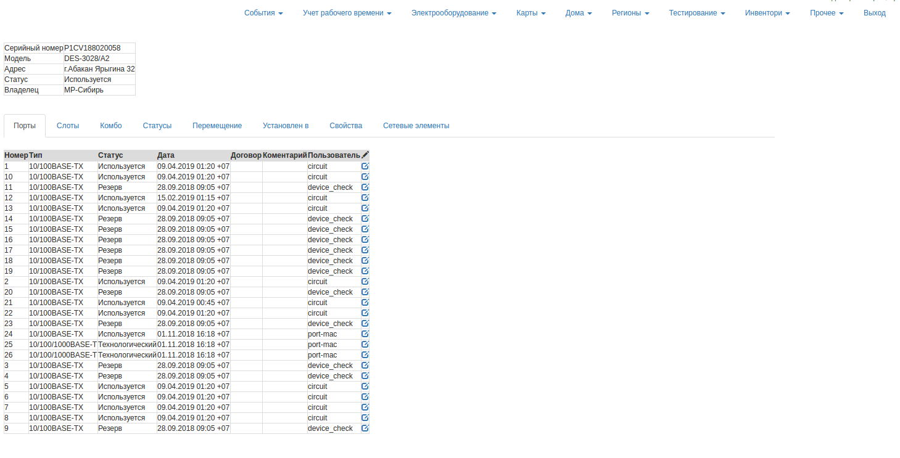
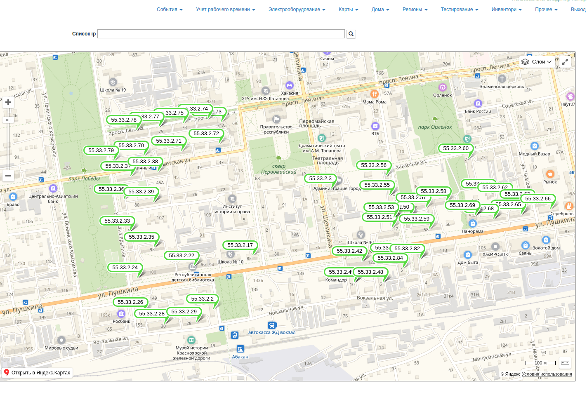
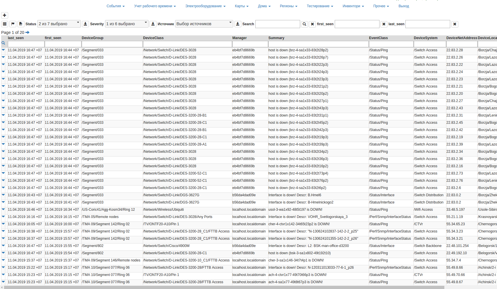

## ISS (Информационно справочная система)

**Основное назначение** сбор и хранение информации по состоянию портов устройств абонентского доступа

**Вывод информации по оборудованию**

**Отображение расположения устройств на карте**

**Мониторинг событий на оборудовании**

